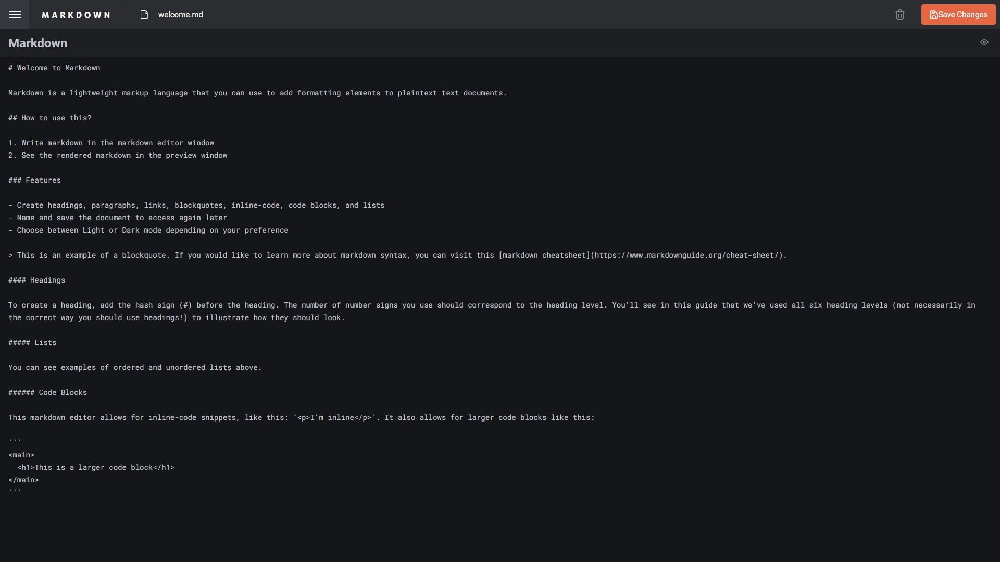
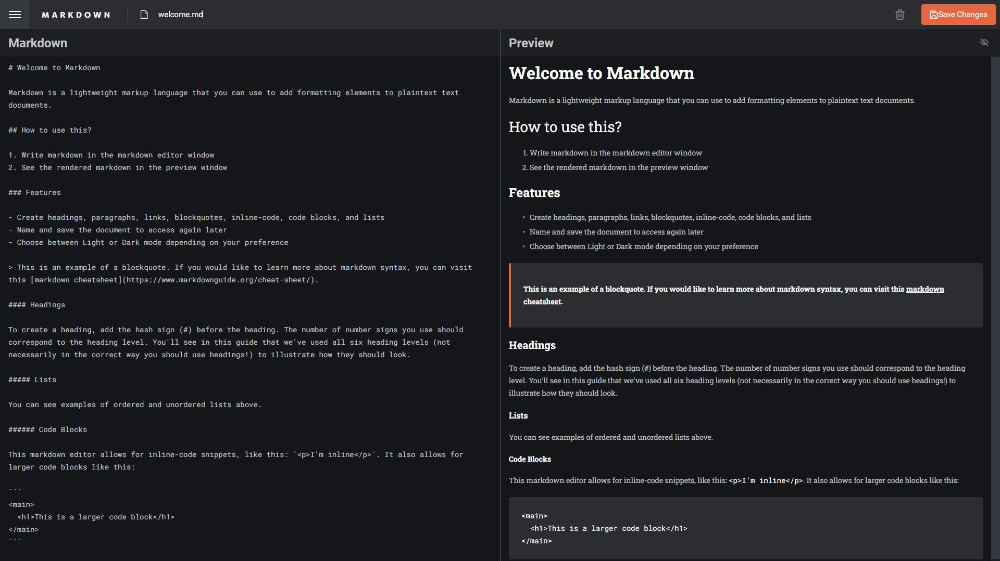

# In-browser markdown editor solution

This is my solution to the [In-browser markdown editor challenge on Frontend Mentor](https://www.frontendmentor.io/challenges/inbrowser-markdown-editor-r16TrrQX9).

## Table of contents

- [Overview](#overview)
  - [The challenge](#the-challenge)
  - [Screenshot](#screenshot)
  - [Links](#links)
- [My process](#my-process)
  - [Built with](#built-with)
  - [What I learned](#what-i-learned)
  - [Continued development](#continued-development)
  - [Useful resources](#useful-resources)
- [Author](#author)

## Overview

### The challenge

Users should be able to:

- Create, Read, Update, and Delete markdown documents
- Name and save documents to be accessed as needed
- Edit the markdown of a document and see the formatted preview of the content
- View the optimal layout for the app depending on their device's screen size
- See hover states for all interactive elements on the page
- Store files, last accessed file, and dark mode preferences in localStorage

### Screenshot




### Links

- [Solution URL](https://your-solution-url.com)
- [Live Site URL](https://helsel-markdown-editor.netlify.app/)

## My process

### Built with

- Semantic HTML5 markup
- Flexbox
- Mobile-first workflow
- [React](https://reactjs.org/)
- [React Markdown](https://github.com/remarkjs/react-markdown)
- [SVGR](https://react-svgr.com/)
- [Next.js](https://nextjs.org/)
- [TypeScript](https://www.typescriptlang.org/)
- [SCSS](https://sass-lang.com/)

### What I learned

This was my first NextJS project. Originally I planned to incorporate a database, but it was hard to justify given the design provided. I would not want to store someone's files in that way without authentication, which would require me to extensively build on the original design. I may do that down the line as a seperate project, but for the purposes of this Frontend Mentor challenge I didn't want to expand the scope. There was a bit of a learning curve with NextJS, but after a little trial and error it was much like building any other React app. CSS modules are a great feature I used extensively, giving most components their own style modules. This was also my first time using localStorage with a React app. I'm quite proud of the way I've implemented it but would love feedback.

```ts
import Data from '../../../data.json'

const getDarkModePreference = (): boolean => {
    if (typeof window !== 'undefined' && window.localStorage) {
        if(localStorage.getItem('darkModePref') !== null) {
            const darkModePref = localStorage.getItem('darkModePref');
    
            if (darkModePref === 'true')
                return true;
            else
                return false;
        }
        const prefersDark = window.matchMedia('(prefers-color-scheme: dark)').matches;
    
        if (prefersDark)
            localStorage.setItem('darkModePref', 'true');
        else
            localStorage.setItem('darkModePref', 'false')
    }
    return false;
}
  
const setDate = (data: DataSet) => {
    const now = new Date();
    let year = now.getFullYear().toString();
    let month = (now.getMonth() + 1).toString();
    if (Number(month) < 10)
        month = '0' + month;
  
    let day = now.getDate().toString();
    if(Number(day) < 10)
        day = '0' + day;
  
    data.createdAt = `${month}-${day}-${year}`
}
  
const checkForLocalFiles = (): Array<DataSet> => {
    if (typeof window !== 'undefined' && window.localStorage) {
        if (localStorage.getItem('files') !== null) {
            const files = JSON.parse(localStorage.getItem('files') ?? "");
            return files;
        } else {
            Data.forEach((el) => {
                setDate(el);
            })
            return Data;
        }
    } else {
        return Data;
    }
}
  
const checkLastCurrentFile = (): number => {
    if (typeof window !== 'undefined' && window.localStorage) {
        const currentFile = localStorage.getItem('currentFile');
        if (currentFile !== null) {
            return parseInt(currentFile);
        } else {
            localStorage.setItem('currentFile', '0')
            return 0;
        }
    }
    return 0;
}

const [darkMode, setDarkMode] = useState(getDarkModePreference());
const [currentFile, setCurrentFile] = useState(checkLastCurrentFile());
const [fileList, setFileList] = useState(checkForLocalFiles());
```

I had to deal with an issue I probably would not have had in a standard React app, which is that localStorage is undefined before the page is served to the user. That took a bit of troubleshooting, and then caused an issue where the default rendered page would pop in before the user's preference and saved files are loaded. I was able to fix that with a bit of state.

```ts
function Main() {

    const [loading, setLoading] = useState(true);

    useEffect(() => {
        setLoading(false);
    }, [])

    return(
        <>
            {
                loading ? 
                <>
                    //The entire app goes in here
                </>
                :
                <></>
            }
        </>
    )
}
```

I also found myself making much more use of the `useEffect()` hook as my understanding of it has increased greatly. I can't believe how long I've been making React apps without making better use of it.

### Continued development

I would definitely like to add the ability to download markdown files, even though that's not in the original spec. I would also like to add authentication and a database as mentioned above. For now, this is a pretty solid MVP and I'm happy with it's current state.

### Useful resources

- [LocalStorage is not defined NextJS](https://developer.school/snippets/react/localstorage-is-not-defined-nextjs) - This was an issue I ran into when trying to deploy my site and required some refactoring. The article helped me figure out what exactly was going on and presented a part of what ultimately became my solution.

## Author

- Website - [Jeremy Helsel](https://jeremyhelsel.com/)
- Frontend Mentor - [@JIH7](https://www.frontendmentor.io/profile/JIH7)
- LinkedIn - [Jeremy Helsel](https://www.linkedin.com/in/jeremy-helsel-246798198/)
